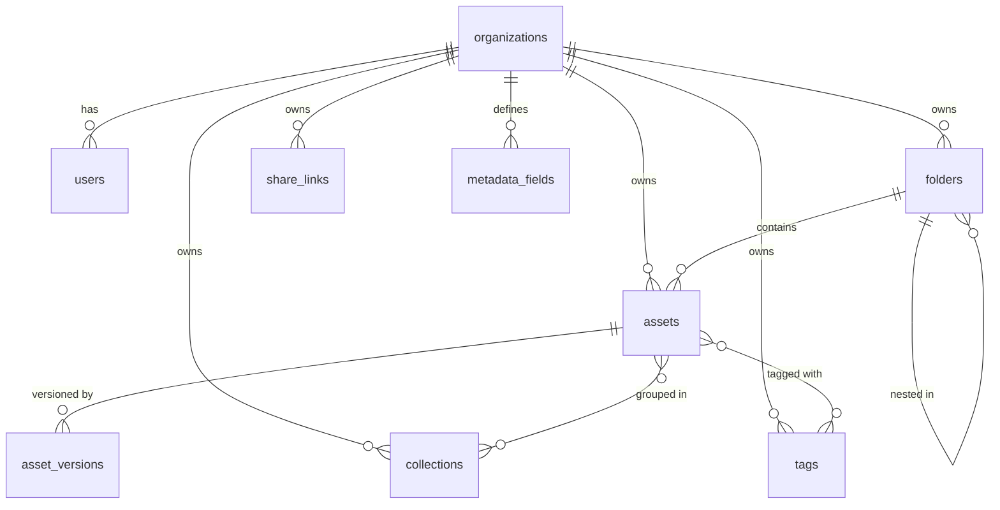

<p align="center">
  <h1 align="center">Vaultra — Digital Asset Management System</h1>
  <p align="center">
    <strong>Enterprise-grade digital asset management without enterprise-grade complexity.</strong>
  </p>
  <p align="center">
    <a href="#features">Features</a> •
    <a href="#tech-stack">Tech Stack</a> •
    <a href="#getting-started">Getting Started</a> •
    <a href="#project-structure">Project Structure</a> •
    <a href="#database-schema">Database Schema</a> •
    <a href="#contributing">Contributing</a> •
    <a href="#license">License</a>
  </p>
</p>

---

##  Overview

**Vaultra** is a modern Digital Asset Management (DAM) system built for mid-size and large organizations that need a centralized, secure, and searchable home for all their brand, marketing, and product assets — logos, photography, videos, templates, campaign files, and more.

Unlike heavyweight enterprise DAM tools (Bynder, Brandfolder, Widen), Vaultra delivers enterprise-grade control with a lean, modern stack — making it accessible to teams that want precision and speed without the complexity and cost.

##  Features

| Feature | Description |
|---|---|
| ** Asset Upload** | Drag-and-drop or bulk upload of images, videos, documents, and design files |
| ** Folder & Collection Structure** | Nested folders plus flat "collections" (saved groupings without moving files) |
| ** Metadata & Manual Tagging** | Custom metadata fields per organization + free-text and controlled-vocabulary tags |
| ** Search & Filter** | Full-text search across filenames, tags, and metadata with filter facets |
| ** Role-Based Permissions** | Organization-level roles: Owner, Admin, Manager, Contributor, Viewer |
| ** Shareable Links** | Public or password-protected links with expiry dates, revocable anytime |
| ** Branded Portal** | Org-level branded landing page (logo, colors) for external share links |
| ** Asset Preview** | In-browser preview for images, video, and PDF without downloading |
| ** Version History** | Re-upload replaces assets while preserving prior versions for rollback/audit |

##  Tech Stack

| Layer | Technology | Purpose |
|---|---|---|
| **Frontend** | Next.js 14 (App Router) | Server components, routing, and SSR |
| **Language** | TypeScript 5 | Type safety across the full stack |
| **Styling** | Tailwind CSS 3 | Utility-first styling with custom design tokens |
| **Database** | PostgreSQL (Supabase) | Relational storage with Row-Level Security |
| **Auth** | Supabase Auth (GoTrue) | Email/password + invite flows with JWT sessions |
| **File Storage** | Supabase Storage | S3-compatible object storage for assets |
| **Image Processing** | Sharp | Server-side thumbnail and preview generation |
| **Validation** | Zod | Runtime schema validation for forms and API payloads |
| **Hosting** | Vercel | Zero-config deployment with CI/CD |

##  Getting Started

### Prerequisites

- **Node.js** 18+ and **npm**
- A **Supabase** project ([create one free](https://supabase.com))

### 1. Clone the Repository

```bash
git clone https://github.com/Tech-Shadow21/dam_system.git
cd dam_system
```

### 2. Install Dependencies

```bash
npm install
```

### 3. Configure Environment Variables

Copy the example environment file and fill in your values:

```bash
cp .env.example .env.local
```

Required variables:

| Variable | Description |
|---|---|
| `NEXT_PUBLIC_SUPABASE_URL` | Your Supabase project URL |
| `NEXT_PUBLIC_SUPABASE_ANON_KEY` | Supabase public/anon key (safe for browser) |
| `SUPABASE_SERVICE_ROLE_KEY` | Server-only key that bypasses RLS (**never expose to client**) |
| `SUPABASE_STORAGE_BUCKET` | Name of the Supabase storage bucket (default: `vaultra-assets`) |
| `NEXT_PUBLIC_APP_URL` | Base app URL (default: `http://localhost:3000`) |
| `SHARE_LINK_SIGNING_SECRET` | Secret for signing share tokens (generate with command below) |

Generate a share link signing secret:

```bash
node -e "console.log(require('crypto').randomBytes(32).toString('hex'))"
```

### 4. Set Up the Database

Run the SQL migration files in your Supabase SQL editor in order:

```
supabase/migrations/0001_initial_schema.sql
supabase/migrations/0002_rls_policies.sql
supabase/migrations/0003_storage_bucket_policies.sql
supabase/migrations/0004_search.sql
```

Optionally seed with sample data:

```bash
# Run supabase/seed.sql in your Supabase SQL editor
```

### 5. Run the Development Server

```bash
npm run dev
```

Open [http://localhost:3000](http://localhost:3000) in your browser.

### 6. Verify the Build

```bash
npm run verify
```

This runs type checking, database tests, and the production build to ensure everything is working.

## 📂 Project Structure

```
dam_system/
├── app/
│   ├── (auth)/                    # Authentication pages
│   │   ├── login/                 # Login page & form
│   │   ├── signup/                # Sign-up page & form
│   │   └── invite/                # Invite acceptance flow
│   ├── (dashboard)/               # Authenticated app shell
│   │   ├── page.tsx               # Home / recent assets
│   │   ├── library/               # Folder browsing & asset detail
│   │   ├── collections/           # Collection management
│   │   ├── search/                # Search & filter interface
│   │   ├── shares/                # Manage active share links
│   │   └── settings/              # Org, user, branding settings
│   ├── (public)/                  # Unauthenticated routes
│   │   └── share/[token]/         # External branded share portal
│   └── api/                       # API routes
│       ├── upload/                # File upload endpoint
│       └── assets/[id]/           # Asset CRUD operations
├── components/
│   ├── ui/                        # Shared primitives (Button, Modal, Card, etc.)
│   ├── asset/                     # Asset-specific components
│   ├── folder/                    # Folder tree & breadcrumb
│   ├── layout/                    # App shell, sidebar, topbar
│   └── share/                     # Share link & portal components
├── lib/
│   ├── supabase/                  # Supabase client configurations
│   │   ├── client.ts              # Browser client
│   │   ├── server.ts              # Server component/action client
│   │   └── admin.ts               # Service-role client (server-only)
│   ├── storage/                   # File storage & thumbnail utilities
│   ├── permissions.ts             # Role → permission mapping
│   ├── auth.ts                    # Authentication helpers
│   ├── queries.ts                 # Database query helpers
│   ├── share-links.ts             # Share link token utilities
│   └── validation/                # Zod schemas
├── types/
│   └── database.ts                # Supabase generated types
├── supabase/
│   ├── migrations/                # SQL migration files (4 files)
│   ├── seed.sql                   # Sample data seed
│   └── tests/                     # Database tests (schema, RLS, search, etc.)
├── middleware.ts                   # Route protection & session refresh
├── tailwind.config.ts             # Custom design tokens & theme
├── next.config.mjs                # Next.js configuration
└── package.json
```

## 🗄️ Database Schema

The database is designed around a **single-organization-per-account** model with full Row-Level Security (RLS).



### Key Tables

| Table | Purpose |
|---|---|
| `organizations` | Org profile, branding (logo, colors), plan tier |
| `users` | Members with roles (owner/admin/manager/contributor/viewer) |
| `folders` | Hierarchical nested folder structure |
| `collections` | Flat groupings of assets (virtual folders) |
| `assets` | Core asset records with metadata, versioning, and soft delete |
| `asset_versions` | Version history for every re-upload |
| `tags` | Organization-scoped tags |
| `share_links` | Expiring, optionally password-protected share links |
| `metadata_fields` | Custom per-org metadata field definitions |

##  Roles & Permissions

| Role | View | Upload | Edit/Tag | Delete | Manage Users | Org Settings |
|---|---|---|---|---|---|---|
| **Viewer** | Yes | No | No | No | No | No |
| **Contributor** | Yes | Yes | Own only | No | No | No |
| **Manager** | Yes | Yes | Yes | Yes | No | No |
| **Admin** | Yes | Yes | Yes | Yes | Yes | Yes |
| **Owner** | Yes | Yes | Yes | Yes | Yes | Yes |

##  Available Scripts

| Command | Description |
|---|---|
| `npm run dev` | Start the development server |
| `npm run build` | Build for production |
| `npm run start` | Start the production server |
| `npm run lint` | Run ESLint |
| `npm run typecheck` | Run TypeScript type checking |
| `npm run db:test` | Run all database tests (schema, RLS, search, permissions) |
| `npm run verify` | Full verification: typecheck + db tests + build |

##  Contributing

Contributions are welcome! Here's how to get started:

1. **Fork** the repository
2. **Create** a feature branch (`git checkout -b feature/amazing-feature`)
3. **Commit** your changes (`git commit -m 'Add amazing feature'`)
4. **Push** to the branch (`git push origin feature/amazing-feature`)
5. **Open** a Pull Request

### Guidelines

- Follow the existing code structure and patterns
- Server Actions live alongside the routes that use them (e.g., `app/(dashboard)/library/actions.ts`)
- Use Zod schemas for all form/API validation
- Ensure RLS policies cover any new tables
- Run `npm run verify` before submitting

##  License

This project is open source and available under the [MIT License](LICENSE).

---

<p align="center">
  Built with using Next.js, Supabase, and TypeScript
</p>
