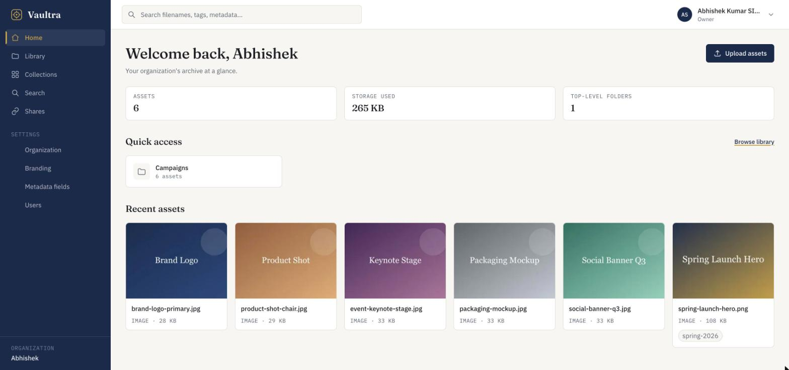
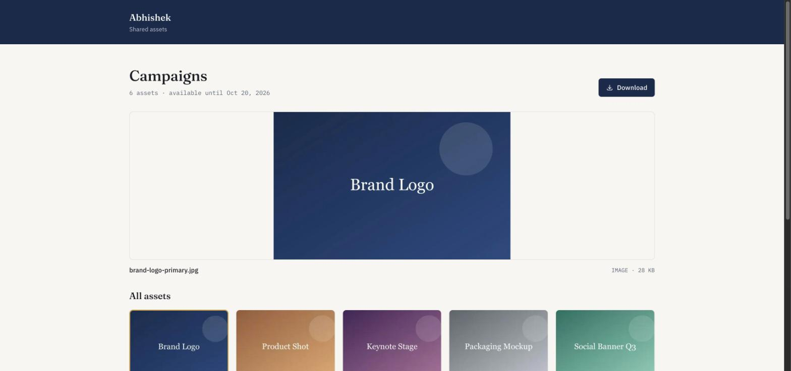
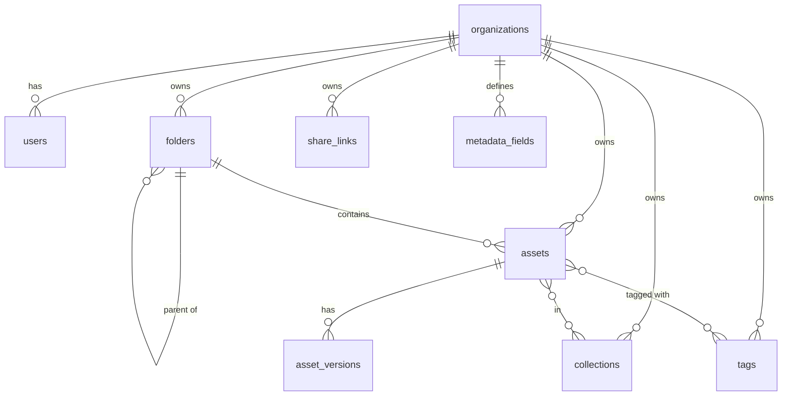

# Vaultra

Vaultra is a digital asset management (DAM) app. Teams use it to store, organize, tag, search and share files such as logos, photos, videos and documents.

Built with Next.js 14, TypeScript, Tailwind CSS and Supabase.



## Features

- Upload files by drag and drop or file picker, up to 5 GB each. Files go directly to storage through signed URLs. Image thumbnails are generated on the server with Sharp.
- Organize assets in nested folders. Collections group assets without moving them.
- Tag assets from a shared tag list, and add custom metadata fields per organization.
- Search filenames, tags and metadata (Postgres full-text search). Filter by file type, tag, folder and uploader.
- Share a single asset or a folder with a link. Each link has an expiry date and can require a password, block downloads, or be revoked at any time.
- Shared links open on a public page that shows your organization's name, logo and colors.
- Replacing a file keeps earlier versions, so you can see and restore them.
- Five roles: Owner, Admin, Manager, Contributor, Viewer. Permissions are checked in the app and in the database through Row-Level Security.
- Admins invite team members by link and choose their role.

Recipients of a share link see this page:



## Tech stack

| Layer | Technology |
|---|---|
| Framework | Next.js 14 (App Router, Server Actions) |
| Language | TypeScript 5 |
| Styling | Tailwind CSS 3 |
| Database | PostgreSQL on Supabase, with Row-Level Security |
| Auth | Supabase Auth (email and password) |
| File storage | Supabase Storage (private bucket) |
| Image processing | Sharp |
| Validation | Zod |
| Tests | PGlite (Postgres running in-process) |

## Setup

You need Node.js 18 or newer, a Supabase project (the free tier works), and the [Supabase CLI](https://supabase.com/docs/guides/cli) (`brew install supabase/tap/supabase`).

1. Clone the repo and install dependencies:

   ```bash
   git clone https://github.com/Tech-Shadow21/dam_system.git
   cd dam_system
   npm install
   ```

2. Link your Supabase project and apply the migrations:

   ```bash
   supabase login
   supabase link --project-ref <your-project-ref>
   supabase db push
   ```

   This runs the four files in `supabase/migrations/`, which create the tables, security policies, the private `vaultra-assets` storage bucket and the search functions. Without the CLI, you can paste each file into the Supabase SQL editor in numeric order.

3. Create `.env.local`:

   ```bash
   cp .env.example .env.local
   ```

   | Variable | Value |
   |---|---|
   | `NEXT_PUBLIC_SUPABASE_URL` | Project URL, from Project Settings > API |
   | `NEXT_PUBLIC_SUPABASE_ANON_KEY` | The `anon` key from the same page |
   | `SUPABASE_SERVICE_ROLE_KEY` | The `service_role` key. Keep this secret and server-side only. |
   | `SUPABASE_STORAGE_BUCKET` | `vaultra-assets` |
   | `NEXT_PUBLIC_APP_URL` | `http://localhost:3000` for local development |
   | `SHARE_LINK_SIGNING_SECRET` | Output of `node -e "console.log(require('crypto').randomBytes(32).toString('hex'))"` |

   You can also print the keys with `supabase projects api-keys --project-ref <your-project-ref>`.

4. Start the app:

   ```bash
   npm run dev
   ```

   Open http://localhost:3000 and sign up. The first account creates the organization and becomes its Owner. If email confirmation is enabled in Supabase Auth (the default), click the link in the confirmation email before signing in.

`supabase/seed.sql` is optional. It creates a sample organization with folders and tags but no users, so you can't sign in to it.

## Roles

| Permission | Viewer | Contributor | Manager | Admin | Owner |
|---|:-:|:-:|:-:|:-:|:-:|
| View, search and download | ✓ | ✓ | ✓ | ✓ | ✓ |
| Upload | | ✓ | ✓ | ✓ | ✓ |
| Edit, tag and delete own assets | | ✓ | ✓ | ✓ | ✓ |
| Create collections and share links | | ✓ | ✓ | ✓ | ✓ |
| Edit, tag and delete any asset | | | ✓ | ✓ | ✓ |
| Manage folders, tags and metadata fields | | | ✓ | ✓ | ✓ |
| Manage other users' share links | | | ✓ | ✓ | ✓ |
| Invite and manage users | | | | ✓ | ✓ |
| Organization settings and branding | | | | ✓ | ✓ |
| Billing and deleting the organization | | | | | ✓ |

The same rules exist in `lib/permissions.ts` and in the SQL function `has_permission()`. A test fails if the two disagree.

## Tests

```bash
npm run db:test   # database tests
npm run verify    # type check, database tests and production build
```

The database tests run on PGlite and don't need a Supabase project. They cover the schema, Row-Level Security (one organization can't read another's data), search, the permission check above, color contrast, and the main flow from sign-up to upload, tagging, search, sharing and revoking a link.

## Project structure

```
app/
  (auth)/               login, sign-up, invite acceptance
  (dashboard)/          home, library, collections, search, shares, settings
  (public)/share/       public share page and downloads
  api/                  upload and asset endpoints
components/             UI components (asset, folder, layout, share, ui)
lib/
  supabase/             Supabase clients (browser, server, service role)
  storage/              uploads, storage access, thumbnails
  validation/           Zod schemas
  permissions.ts        role permissions
  share-links.ts        share link tokens and lookup
supabase/
  migrations/           SQL migrations 0001-0004
  tests/                database tests
  seed.sql              optional sample data
  config.toml           Supabase CLI config
types/database.ts       database types
middleware.ts           session refresh and route protection
```

## Database

Each user belongs to one organization. Row-Level Security limits every query to rows from the user's own organization.


```mermaid
erDiagram
    organizations ||--o{ users : has
    organizations ||--o{ folders : owns
    organizations ||--o{ collections : owns
    organizations ||--o{ assets : owns
    organizations ||--o{ tags : owns
    organizations ||--o{ share_links : owns
    organizations ||--o{ metadata_fields : defines
    folders ||--o{ folders : "parent of"
    folders ||--o{ assets : contains
    assets ||--o{ asset_versions : has
    assets }o--o{ collections : "in"
    assets }o--o{ tags : "tagged with"
```

## Known limitations

- Invite emails are not sent automatically. After inviting someone, an admin copies the invite link and sends it.
- Failed password attempts on share links are counted in server memory, so the count resets when the server restarts.
- Supabase's free tier allows a 500 MB database and 1 GB of file storage, and pauses projects after about a week without activity. A paused project can be restored from the Supabase dashboard.

## Contributing

Create a branch, make your change, run `npm run verify`, and open a pull request.

- Put Server Actions next to the route that uses them, for example `app/(dashboard)/library/actions.ts`.
- Validate form and API input with Zod schemas in `lib/validation/`.
- Add Row-Level Security policies for any new table.
- If you change permissions, update both `lib/permissions.ts` and `has_permission()`.
